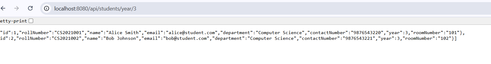

# 🏠 Hostel Management System

A comprehensive **Spring Boot** application for managing hostel operations including student accommodation, room allocation, and staff management.

## 📋 Table of Contents

- [Overview](#-overview)
- [Features](#-features)
- [Technology Stack](#-technology-stack)
- [Project Structure](#-project-structure)
- [Getting Started](#-getting-started)
- [API Documentation](#-api-documentation)
- [API Screenshots](#-api-screenshots)
- [Database Schema](#-database-schema)
- [Configuration](#️-configuration)
- [Testing](#-testing)
- [Contributing](#-contributing)

## 🎯 Overview

The Hostel Management System is a RESTful web application designed to streamline hostel operations. It provides efficient management of students, rooms, and staff with proper relationship mapping and comprehensive filtering capabilities.

### Key Highlights
- **Modern Architecture**: Built with Spring Boot 3.x and Java 17+
- **In-Memory Database**: H2 database for quick setup and testing
- **RESTful APIs**: Clean and intuitive REST endpoints
- **Exception Handling**: Comprehensive error handling with custom exceptions
- **Advanced Pagination**: Multiple sorting, custom indexing, null handling, and performance monitoring
- **Data Relationships**: Proper JPA entity relationships and mappings

## ✨ Features

### 🎓 Student Management
- Student registration and profile management
- Room assignment tracking
- Department and year-wise filtering
- Academic year classification

### 🏠 Room Management
- Room allocation and availability tracking
- Floor-wise and type-wise room organization
- Occupancy monitoring with student lists
- Staff assignment for room management

### 👥 Staff Management
- Staff profile and role management
- Shift-based scheduling (Day/Night)
- Room assignment and responsibility tracking
- Role-based access (Warden, Security, etc.)

### 🔍 Advanced Features

#### Filtering & Search
- Filter students by department, year, or room status
- Filter rooms by availability, floor, type, or occupancy
- Filter staff by role, shift, or room assignments
- Search with pagination across all entities

#### Pagination & Sorting
- **Multiple Field Sorting**: Sort by multiple fields with different directions
- **Custom Indexing**: Support for 1-based page indexing
- **Null Handling**: Sort with nulls first or last
- **Performance Monitoring**: Query execution time tracking
- **Metadata**: Complete pagination information
- **Flexible Page Sizes**: Configurable page sizes with limits

## 🛠 Technology Stack

| Component | Technology |
|-----------|------------|
| **Backend Framework** | Spring Boot 3.5.4 |
| **Language** | Java 17+ |
| **Database** | H2 In-Memory Database |
| **ORM** | Spring Data JPA / Hibernate |
| **Build Tool** | Maven |
| **API Documentation** | REST APIs |
| **Security** | Spring Security (Basic Auth) |

## 📁 Project Structure

```
hostelmanagement/
├── src/main/java/com/example/hostelmanagement/
│   ├── controller/          # REST Controllers
│   │   ├── StudentController.java
│   │   ├── RoomController.java
│   │   └── StaffController.java
│   ├── dto/                 # Data Transfer Objects
│   │   ├── StudentResponseDto.java
│   │   ├── RoomResponseDto.java
│   │   └── StaffResponseDto.java
│   ├── entity/              # JPA Entities
│   │   ├── Student.java
│   │   ├── Room.java
│   │   └── Staff.java
│   ├── exception/           # Custom Exceptions
│   │   ├── StudentNotFoundException.java
│   │   ├── RoomNotFoundException.java
│   │   └── StaffNotFoundException.java
│   ├── repository/          # JPA Repositories
│   │   ├── StudentRepository.java
│   │   ├── RoomRepository.java
│   │   └── StaffRepository.java
│   ├── service/             # Business Logic
│   │   ├── StudentService.java
│   │   ├── RoomService.java
│   │   └── StaffService.java
│   └── HostelmanagementApplication.java
├── src/main/resources/
│   └── application.properties
└── README.md
```

## 🚀 Getting Started

### Prerequisites
- **Java 17** or higher
- **Maven 3.6+**
- **IDE** (IntelliJ IDEA, Eclipse, VS Code)

### Installation & Setup

1. **Clone the repository**
   ```bash
   git clone <repository-url>
   cd hostelmanagement
   ```

2. **Create screenshots folder** (for documentation)
   ```bash
   mkdir screenshots
   ```

3. **Build the project**
   ```bash
   mvn clean compile
   ```

4. **Run the application**
   ```bash
   mvn spring-boot:run
   ```

5. **Access the application**
   - **API Base URL**: `http://localhost:8085`
   - **H2 Console**: `http://localhost:8085/h2-console`
     - JDBC URL: `jdbc:h2:mem:testdb`
     - Username: `sa`
     - Password: *(empty)*

### Sample Data
The application automatically loads sample data on startup:
- **10 Students** (Alice, Bob, Charlie, Diana, Eve, Frank, Grace, Henry, Ivy, Jack)
- **8 Rooms** (101-103, 201-203, 301-302) across 3 floors
- **5 Staff Members** (Alice Warden, Bob Security, Charlie Cleaner, Diana Maintenance, Eve Manager)
- **Null Values** for testing: Grace Taylor (null email), Eve Manager (null shift), Room 301 (null status)

## 📚 API Documentation

### 🎓 Student APIs

#### Basic Operations
| Method | Endpoint | Description |
|--------|----------|-------------|
| `GET` | `/api/students` | Get all students |
| `GET` | `/api/students/department/{department}` | Get students by department |
| `GET` | `/api/students/year/{year}` | Get students by academic year |
| `GET` | `/api/students/without-room` | Get unassigned students |

#### Advanced Pagination & Search
| Method | Endpoint | Description |
|--------|----------|-------------|
| `GET` | `/api/students/page` | Get paginated students |
| `GET` | `/api/students/metadata` | Get pagination metadata |
| `GET` | `/api/students/search` | Search students with pagination |
| `GET` | `/api/students/changedefaultindex` | Custom page indexing (1-based) |
| `GET` | `/api/students/sorted-nulls` | Sort by email field with null handling |
| `GET` | `/api/students/performance` | Performance monitoring |

### 🏠 Room APIs

#### Basic Operations
| Method | Endpoint | Description |
|--------|----------|-------------|
| `GET` | `/api/rooms` | Get all rooms |
| `GET` | `/api/rooms/available` | Get available rooms |
| `GET` | `/api/rooms/floor/{floor}` | Get rooms by floor |
| `GET` | `/api/rooms/type/{roomType}` | Get rooms by type |
| `GET` | `/api/rooms/occupied` | Get occupied rooms |

#### Advanced Pagination & Search
| Method | Endpoint | Description |
|--------|----------|-------------|
| `GET` | `/api/rooms/page` | Get paginated rooms |
| `GET` | `/api/rooms/metadata` | Get pagination metadata |
| `GET` | `/api/rooms/search` | Search rooms with pagination |
| `GET` | `/api/rooms/changedefaultindex` | Custom page indexing (1-based) |
| `GET` | `/api/rooms/sorted-nulls` | Sort by status field with null handling |
| `GET` | `/api/rooms/performance` | Performance monitoring |

### 👥 Staff APIs

#### Basic Operations
| Method | Endpoint | Description |
|--------|----------|-------------|
| `GET` | `/api/staff` | Get all staff |
| `GET` | `/api/staff/role/{role}` | Get staff by role |
| `GET` | `/api/staff/shift/{shift}` | Get staff by shift |
| `GET` | `/api/staff/with-rooms` | Get staff managing rooms |
| `GET` | `/api/staff/without-rooms` | Get staff without room assignments |

#### Advanced Pagination & Search
| Method | Endpoint | Description |
|--------|----------|-------------|
| `GET` | `/api/staff/page` | Get paginated staff |
| `GET` | `/api/staff/metadata` | Get pagination metadata |
| `GET` | `/api/staff/search` | Search staff with pagination |
| `GET` | `/api/staff/changedefaultindex` | Custom page indexing (1-based) |
| `GET` | `/api/staff/sorted-nulls` | Sort by shift field with null handling |
| `GET` | `/api/staff/performance` | Performance monitoring |

### 📝 Sample API Requests

#### Basic Requests
```bash
# Get all students
curl http://localhost:8085/api/students

# Get students in Computer Science department
curl http://localhost:8085/api/students/department/Computer%20Science

# Get available rooms
curl http://localhost:8085/api/rooms/available

# Get staff with WARDEN role
curl http://localhost:8085/api/staff/role/WARDEN
```

#### Advanced Pagination Requests
```bash
# Paginated students with sorting
curl "http://localhost:8085/api/students/page?page=0&size=5&sort=name,asc"

# Multiple field sorting
curl "http://localhost:8085/api/students/page?sort=department,asc&sort=year,desc&sort=name,asc"

# Search with pagination
curl "http://localhost:8085/api/students/search?department=Computer%20Science&page=0&size=10"

# Custom indexing (1-based)
curl "http://localhost:8085/api/rooms/changedefaultindex?pageNumber=2&size=5"

# Null sorting (Staff sorted by shift field with null handling)
curl "http://localhost:8085/api/staff/sorted-nulls?page=0&size=10"

# Performance monitoring
curl "http://localhost:8085/api/students/performance?page=0&size=10"

# Get metadata
curl "http://localhost:8085/api/rooms/metadata?page=0&size=5"
```

### 📊 Sample Responses

#### Basic Response
```json
{
  "id": 1,
  "rollNumber": "CS2021001",
  "name": "Alice Smith",
  "email": "alice@student.com",
  "department": "Computer Science",
  "contactNumber": "9876543220",
  "year": 3,
  "roomNumber": "101"
}
```

#### Paginated Response
```json
{
  "content": [
    {
      "id": 1,
      "rollNumber": "CS2021001",
      "name": "Alice Smith",
      "email": "alice@student.com",
      "department": "Computer Science",
      "contactNumber": "9876543220",
      "year": 3,
      "roomNumber": "101"
    }
  ],
  "pageable": {
    "pageNumber": 0,
    "pageSize": 10,
    "sort": {
      "sorted": true,
      "orders": [{
        "property": "name",
        "direction": "ASC"
      }]
    }
  },
  "totalElements": 3,
  "totalPages": 1,
  "first": true,
  "last": true
}
```

#### Metadata Response
```json
{
  "pageNumber": 0,
  "pageSize": 10,
  "totalElements": 3,
  "totalPages": 1,
  "sort": "id: ASC",
  "first": true,
  "last": true
}
```

#### Performance Response
```json
{
  "pageNumber": 0,
  "pageSize": 10,
  "totalElements": 3,
  "totalPages": 1,
  "sort": "id: ASC | Query Time: 15ms",
  "first": true,
  "last": true
}
```

## 📸 API Screenshots

### 🎓 Student API Endpoints

#### Get All Students - `GET /api/students`


#### Get Students by Department - `GET /api/students/department/{department}`


#### Get Students by Year - `GET /api/students/year/{year}`


#### Get Students Without Room - `GET /api/students/without-room`


### 🏠 Room API Endpoints

#### Get All Rooms - `GET /api/rooms`


#### Get Available Rooms - `GET /api/rooms/available`
![Get Available Rooms]!(image-6.png)

#### Get Rooms by Floor - `GET /api/rooms/floor/{floor}`


#### Get Rooms by Type - `GET /api/rooms/type/{roomType}`


#### Get Occupied Rooms - `GET /api/rooms/occupied`


### 👥 Staff API Endpoints

#### Get All Staff - `GET /api/staff`


#### Get Staff by Role - `GET /api/staff/role/{role}`


#### Get Staff by Shift - `GET /api/staff/shift/{shift}`


#### Get Staff with Rooms - `GET /api/staff/with-rooms`


#### Get Staff without Rooms - `GET /api/staff/without-rooms`


---

## 🚀 Advanced Pagination Features Screenshots

### 1. Single Sort - `GET /api/students/page?sort=name,asc`


### 2. Multiple Sorts - `GET /api/rooms/page?sort=floor,asc&sort=roomType,asc&sort=capacity,desc`


### 3. Default Paging and Sorting - `GET /api/staff/page`


### 4. Search with Paging - `GET /api/students/search?department=Computer Science&page=0&size=5`


### 5. Paged Metadata - `GET /api/rooms/metadata?page=0&size=3`


### 6. Customized Sort Null Handling - `GET /api/staff/sorted-nulls?page=0&size=10`


### 7. Change Default Page Index - `GET /api/students/changedefaultindex?pageNumber=2&size=5`


### 8. Performance Check - `GET /api/rooms/performance?page=0&size=5&sort=roomNumber,asc`


---


## 🗄 Database Schema

### Entity Relationships
```
Staff (1) ←→ (N) Room (1) ←→ (N) Student
```

### Key Tables
- **STUDENT**: Student information with room assignment
- **ROOM**: Room details with staff management
- **STAFF**: Staff profiles with room responsibilities

### Foreign Keys
- `student.room_id` → `room.room_id`
- `room.staff_id` → `staff.id`

## ⚙️ Configuration

### Application Properties
```properties
# Server Configuration
server.port=8085

# Database Configuration
spring.datasource.url=jdbc:h2:mem:testdb
spring.h2.console.enabled=true

# JPA Configuration
spring.jpa.show-sql=true
spring.jpa.hibernate.ddl-auto=update

# Security Configuration
spring.security.user.name=admin
spring.security.user.password=password
```

### Environment Variables
| Variable | Description | Default |
|----------|-------------|---------|
| `SERVER_PORT` | Application port | `8085` |
| `DB_URL` | Database URL | `jdbc:h2:mem:testdb` |

---

## 🧪 Testing

### Manual Testing
1. **Start the application**
2. **Use Postman, cURL, or browser** to test endpoints
3. **Check H2 Console** for database verification

### Test Scenarios
- ✅ Retrieve all entities
- ✅ Filter by various criteria
- ✅ Handle not found scenarios
- ✅ Verify relationships
- ✅ Test pagination features
- ✅ Test multiple sorting
- ✅ Test performance monitoring
- ✅ Test custom indexing

### Sample Test Commands
```bash
# Basic endpoints
curl -X GET http://localhost:8085/api/students
curl -X GET http://localhost:8085/api/rooms/floor/1

# Pagination testing
curl -X GET "http://localhost:8085/api/students/page?page=0&size=5"
curl -X GET "http://localhost:8085/api/rooms/page?sort=floor,asc&sort=roomNumber,asc"

# Search testing
curl -X GET "http://localhost:8085/api/students/search?department=Computer%20Science"

# Performance testing
curl -X GET "http://localhost:8085/api/staff/performance?page=0&size=10"

# Exception handling
curl -X GET http://localhost:8085/api/students/department/Physics

# Metadata testing
curl -X GET "http://localhost:8085/api/rooms/metadata?page=0&size=5"
```

### Pagination Testing Examples
```bash
# Multiple sort fields
curl "http://localhost:8085/api/students/page?sort=department,asc&sort=year,desc&sort=name,asc"

# Custom indexing (1-based)
curl "http://localhost:8085/api/rooms/changedefaultindex?pageNumber=2&size=3"

# Null sorting for all entities
curl "http://localhost:8085/api/students/sorted-nulls?page=0&size=10"  # Sorts by email
curl "http://localhost:8085/api/rooms/sorted-nulls?page=0&size=10"     # Sorts by status
curl "http://localhost:8085/api/staff/sorted-nulls?page=0&size=10"     # Sorts by shift

# Performance monitoring
curl "http://localhost:8085/api/students/performance?page=0&size=5&sort=name,asc"
```

## 🤝 Contributing

1. **Fork the repository**
2. **Create a feature branch** (`git checkout -b feature/amazing-feature`)
3. **Commit changes** (`git commit -m 'Add amazing feature'`)
4. **Push to branch** (`git push origin feature/amazing-feature`)
5. **Open a Pull Request**

## 📄 License

This project is licensed under the MIT License - see the [LICENSE](LICENSE) file for details.

## 👨‍💻 Author

**Lokeshwaran M**
- 
- Email: lokeshwaran.m@epssw.com

## 🙏 Acknowledgments

- Spring Boot team for the excellent framework
- H2 Database for easy in-memory testing
- Maven for dependency management

---
